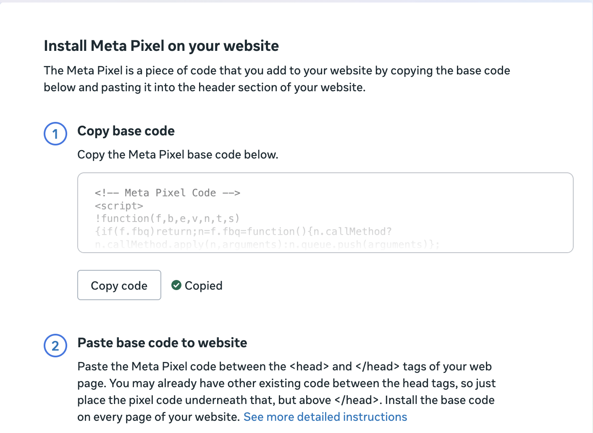
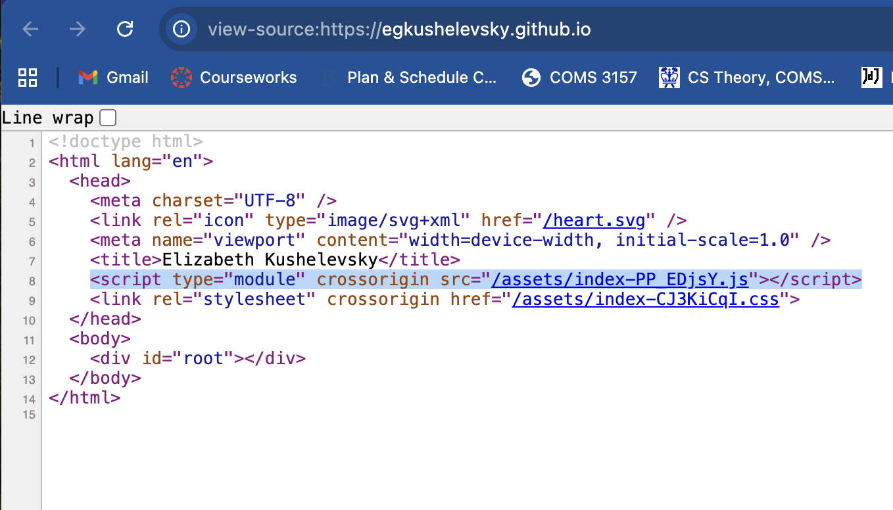
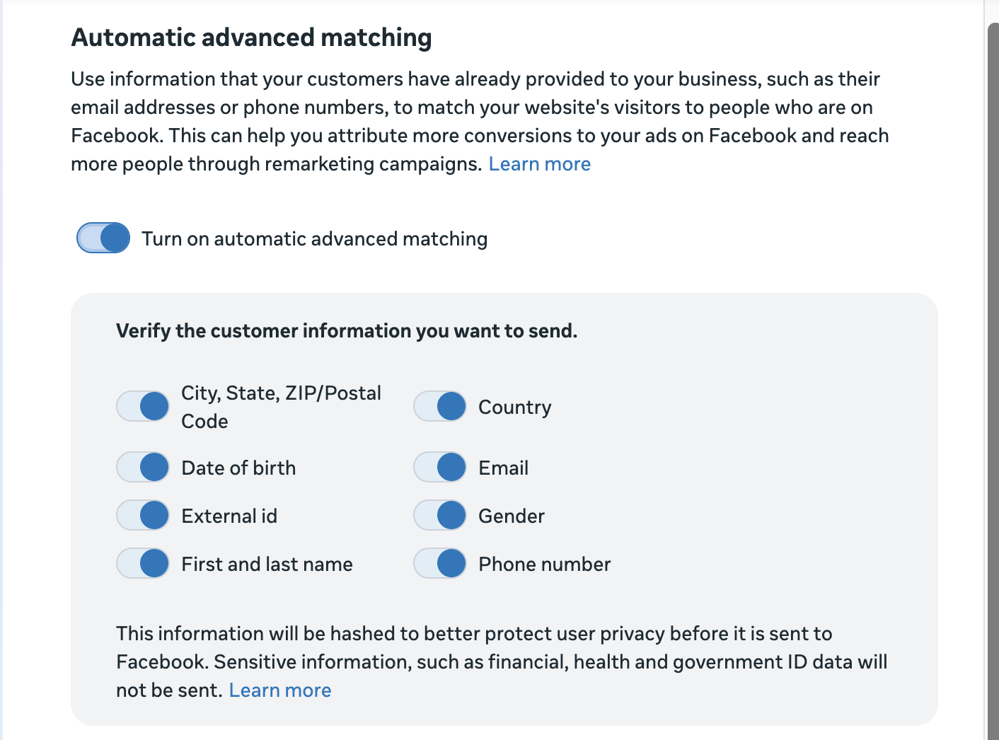

# Implementing a tracking pixel with Meta Pixel
### Overview
Meta Pixel was released as [Facebook Pixel](https://developers.facebook.com/ads/blog/post/v2/2015/10/14/announcing-facebook-pixel/) in 2015, marketing itself as an advertiser-firendly, low-code conversion tracker. Today, it is the most popular tracking pixel on the market, accessible to businesses as a simple copy-and-paste code snippet, working on websites, mobile apps, and instant messaging to build a database of user interaction. Businesses can also track offline customer activity and their own CRM data, all with the goal of building a profile for their customers to better target their ads on Meta platforms.

To learn more about commercial tracking pixels and the data they collect, we implemented our own Meta Pixel on a personal website.

### Setup
The installation process is fairly intuitive, save for some difficulty with creating and verifying a new Facebook account. Once setting up a business account, we were able to go to the [Events Manager center](https://business.facebook.com/events_manager) and connect new data from our target website, [Elizabeth's personal website](https://egkushelevsky.github.io).

Once the dataset was created, we were immediately prompted to generate the tracking pixel with our custom advertising ID.


The only source code involvement was adding the copied lines to the destination html page. Advertisers can also pay to use Meta's Conversions API Gateway for a simpler setup.
```
<!-- Meta Pixel Code -->
<script>
    function(f,b,e,v,n,t,s)
    {if(f.fbq)return;n=f.fbq=function(){n.callMethod?
    n.callMethod.apply(n,arguments):n.queue.push(arguments)};
    if(!f._fbq)f._fbq=n;n.push=n;n.loaded=!0;n.version='2.0';
    n.queue=[];t=b.createElement(e);t.async=!0;
    t.src=v;s=b.getElementsByTagName(e)[0];
    s.parentNode.insertBefore(t,s)}(window, document,'script',
    'https://connect.facebook.net/en_US/fbevents.js');
      bq('init', '1531230738114961');
    fbq('track', 'PageView');
</script>
<!-- End Meta Pixel Code -->
```
Once this setup was done, upon publishing the page, the pixel creation became visible in the page source. The page loads and executes the pixel script with respect to the business's database ID, [index-PP_EDjsY.js](./index-PP_EDjsY.js).



Returning to the Events Manager, we were given the option to turn on automatic advanced matching. This funcitonality [allows](https://www.facebook.com/business/help/611774685654668?id=1205376682832142) Meta to process additional data sent to the site and match website visitors with Facebook users.


Opening the site loads a setup tool, which makes it easy to track specific actions without any code. We set up a few of these trackers for observation simply by selecting the relevant buttons.


### Tracking results
We visited the website from multiple devices and browsers. On Chrome, our Track Snack extension picks up 2 tracking pixels and 6 beacon requests.

https://github.com/user-attachments/assets/5c64cfda-4010-4afa-95ae-dbac1b2a9fa3

Within the Events Manager, site visitation and chosen action data populates within 20 minutes. This site does not collect contact data through any user submission, so the automatic advanced matching did not collect any results. However, the pixel collected information on when the page was visited and when each tracked button was clicked, including the device type. For example, we put a tracker on the email contact link, and the tracker reported each time a browser went to send an email.

Below is sample data collected on content views. Source: ViewContent-Devices-Nov 25, 2025, 12_00 AM_Dec 2, 2025, 12_00 AM.csv
| device_type | device_os | count |
|---|---|---|
mobile_iphone | iOS | 8
desktop | Mac OS X | 5
mobile_ipad | iOS | 4

### Privacy commentary
As we implemented the pixel—without support for automatic advanced matching—the data Meta can collect is limited to standard browser functions. Use of Meta Pixels is more targeted toward businesses with an incentive to track customer habits, especially e-commerce, specifically for better targeted advertising on Meta platforms.

Automatic advanced matching, while it hashes users' data, like email addresses and phone numbers, and does not allow said data to leave the browser, does maintain information on the user whose profile they match the information with. Even if the contact information is not personally identifiable, the user still is through the profile with which they are matched, and the matching is stored by Meta for targeting.
